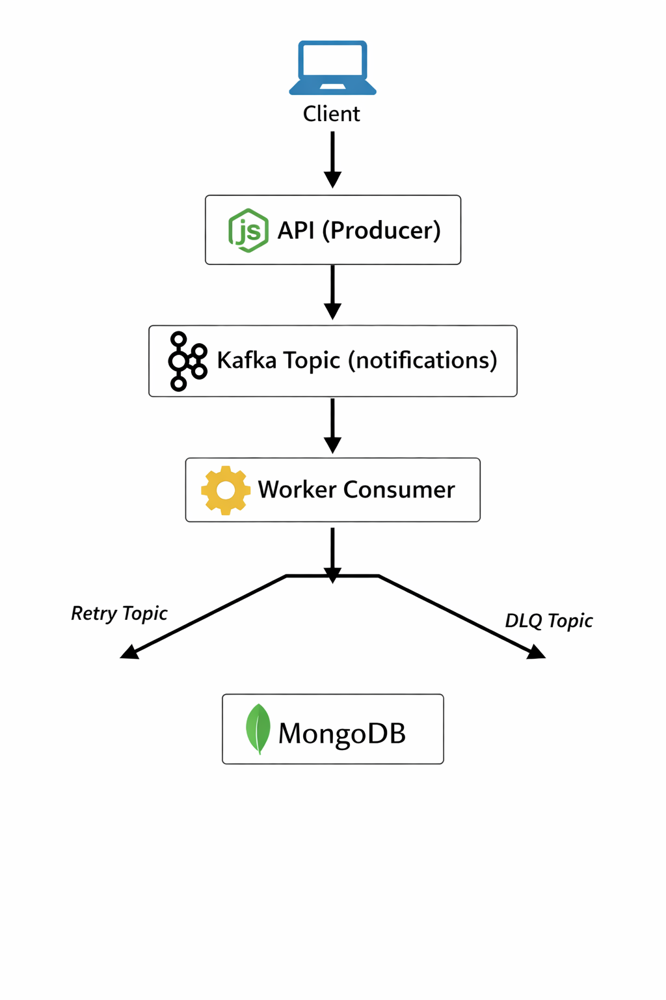

# 🚀 Distributed Notification System

> Production-style **event-driven backend system** inspired by real-world architectures used at Netflix, Uber, and Amazon.

This project demonstrates how to build a **scalable, fault-tolerant notification pipeline** using Kafka, worker consumers, retries, DLQ handling, and observability — the same core ideas used in modern distributed backend systems.

---

## 🧠 System Design Overview

The system processes notifications asynchronously to improve scalability, reliability, and performance.

### High-Level Flow

```text id="y4e9zd"
Client → API (Producer) → Kafka → Worker (Consumer) → MongoDB
                         ↘ Retry Topic
                         ↘ Dead Letter Queue (DLQ)
```

---

## 🧩 Architecture Diagram



---

## ⚡ Core Engineering Concepts

* Event-Driven Architecture (EDA)
* Producer / Consumer pattern
* Kafka Consumer Groups
* Horizontal Worker Scaling
* Retry Queue Strategy
* Dead Letter Queue (DLQ)
* Idempotency (requestId-based)
* Observability & Metrics
* Fault-tolerant processing

---

## 🏗️ Architecture Breakdown

### 1️⃣ API Service (Producer)

Responsibilities:

* Accepts notification requests
* Validates payload
* Ensures idempotency using `requestId`
* Stores initial notification state in MongoDB
* Publishes events to Kafka

Why this matters:

* API remains fast
* Processing is decoupled
* Safe retries possible

---

### 2️⃣ Kafka (Event Backbone)

Kafka acts as the async messaging layer connecting services.

**Topics used:**

* `notifications`
* `notifications_retry`
* `notifications_dlq`

**Benefits:**

* Loose coupling between services
* High throughput event processing
* Durable message storage
* Easy horizontal scaling

---

### 3️⃣ Worker Service (Consumer)

Workers consume events and process notifications asynchronously.

Processing flow:

1. Consume message from Kafka
2. Process notification
3. Update MongoDB status
4. Retry on failure
5. Move to DLQ after max retries

Workers are designed for horizontal scaling using Kafka consumer groups.

---

### 4️⃣ MongoDB (Persistence Layer)

Stores:

* Notification payload
* Processing status
* Retry count
* Metadata

Acts as the source of truth for notification lifecycle.

---

### 5️⃣ Observability (Prometheus)

Metrics endpoint:

```text id="1r41wz"
/metrics
```

Example metrics:

* `notifications_sent_total`
* `notifications_retry_total`
* `notifications_failed_total`
* `kafka_messages_consumed_total`

This enables monitoring, debugging, and scaling analysis.

---

## 📊 Distributed System Flow

1. Client sends notification request
2. API validates + stores data in MongoDB
3. API publishes event → Kafka
4. Worker consumes event
5. Success → mark as SENT
6. Failure → send to Retry Topic
7. Max retries exceeded → send to DLQ

---

## 🚀 Scaling & Load Behavior

This system is designed for horizontal scaling.

### Scale workers

```bash id="tx8ye1"
docker compose up --scale worker=3
```

### What happens internally

* Multiple workers join the same Kafka consumer group
* Kafka automatically distributes partitions
* Workload is balanced across workers
* Throughput increases as workers scale

### Example Observation

| Workers | Processing Speed       |
| ------- | ---------------------- |
| 1       | Baseline               |
| 3       | ~3x faster consumption |

This demonstrates real-world distributed processing behavior.

---

## ⚙️ Design Decisions

### Why Kafka?

* Decouples API and Worker services
* Enables async processing
* Supports scalable consumer groups
* Durable event storage

**Tradeoff:** Adds operational complexity.

---

### Why Retry + DLQ?

* Prevents message loss
* Handles transient failures safely
* Isolates permanently failed events

**Tradeoff:** Additional topics and retry logic.

---

### Why Worker-based Processing?

* API stays responsive
* Work can scale independently
* Better reliability under load

**Tradeoff:** Eventual consistency instead of immediate completion.

---

### Why Idempotency?

Using `requestId` prevents duplicate processing when retries happen.

**Tradeoff:** Extra DB checks for safety.

---

## 🧠 System Design Tradeoffs

This project intentionally models real engineering tradeoffs instead of optimizing only for simplicity.

---

### Async Processing vs Sync API

**Decision:** Async via Kafka.

**Pros:**

* Fast API responses
* Independent scaling
* Failure isolation

**Cons:**

* Eventual consistency
* Requires monitoring

---

### Kafka vs Direct Service Calls

**Decision:** Use Kafka.

**Pros:**

* Loose coupling
* Replayability
* High throughput

**Cons:**

* More infrastructure complexity

---

### Retry Queue + DLQ Strategy

**Decision:** Retry before DLQ.

**Pros:**

* Reliable processing
* Safe failure handling

**Cons:**

* Extra operational logic

---

### Horizontal Worker Scaling

**Decision:** Consumer group scaling.

**Pros:**

* Linear throughput increase
* Easy scaling

**Cons:**

* Ordering depends on partitions

---

### Observability First

**Decision:** Prometheus metrics.

**Pros:**

* Visibility into system health
* Easier debugging and scaling

**Cons:**

* Extra monitoring setup

---

## 📈 Scalability Characteristics

| Component | Scaling Strategy                 |
| --------- | -------------------------------- |
| API       | Horizontal (multiple instances)  |
| Kafka     | Partition-based scaling          |
| Workers   | Consumer group scaling           |
| MongoDB   | Replica sets / sharding (future) |

---

## 🐳 Run Locally

### Start all services

```bash id="k7mxze"
docker compose up --build
```

### Scale workers

```bash id="0e7j4f"
docker compose up --scale worker=3
```

---

## 📂 Project Structure

```text id="2a3k9u"
src/
 ├── api/            # REST API + Kafka producer
 ├── worker/         # Kafka consumer logic
 ├── config/         # Kafka / DB configuration
 ├── models/         # MongoDB schemas
 ├── metrics/        # Prometheus metrics
 ├── utils/          # helpers & retry logic
```

---

## 🔥 Engineering Highlights

✔ Event-driven architecture
✔ Kafka-based communication
✔ Retry + DLQ reliability pattern
✔ Horizontally scalable workers
✔ Observability-first design
✔ Dockerized microservices

---

## 🧪 Future Improvements

* Kubernetes deployment
* Grafana dashboards
* OpenTelemetry tracing
* Rate limiting
* Circuit breaker pattern
* Email / SMS provider integration
* Load testing (k6)

---

## 👨‍💻 Author

**Manikanta Kovvuri**

---

## ⭐ Inspired By

Modern distributed backend architectures used in:

* Netflix
* Uber
* Amazon
* Event-driven microservices systems

---
